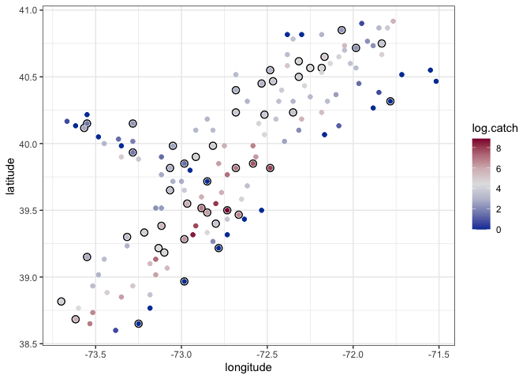

EDA demo
================

# Scallops Data Example

1.  Create a test and training set from the scallop dataset. Then create
    a visual to show the test / training datasets.

<!-- end list -->

``` r
data(scallop)
scallop <- scallop %>% mutate(log.catch = log(tot.catch + 1), 
                              id = 1:n())

data_fig <- scallop %>% ggplot(aes(x=longitude, y = latitude, color = log.catch)) + geom_point() +  theme_bw() + scale_color_gradientn(colours = colorspace::diverge_hcl(7))
data_fig
```

<!-- -->

``` r
scallop_train <- scallop %>% sample_n(100)
scallop_test <- scallop %>% filter(!id %in% scallop_train$id)
```

``` r
data_fig + geom_point(aes(y = latitude, x = longitude), inherit.aes = F, data = scallop_test, color = "black", size = 3)+ geom_point(aes(y = latitude, x = longitude), color = "white", inherit.aes = F, data = scallop_test, size = 2) + geom_point()
```

<!-- -->

2.  Write code to estimate a non-spatial model using just the mean
    structure. Then construct a figure that includes mean predictions
    for each site in the test dataset.

<!-- end list -->

``` r
x <- cbind(scallop_train$latitude,scallop_train$longitude)
d <- sqrt(plgp::distance(x))
num_preds <- nrow(scallop_test)
x_preds <- cbind(scallop_test$latitude,scallop_test$longitude)
d_preds <- sqrt(plgp::distance(x_preds))
d_12 <- sqrt(plgp::distance(x, x_preds))
```

``` stan
data {
  int<lower=0> N; // number of observed data points 
  vector[N] y; // observed response
  int<lower=0> N_preds; // number of predictive points
}

parameters {
  real<lower = 0> tausq;
  real mu;
}

transformed parameters{
  vector[N] mu_vec;
  vector[N] tausq_vec;
  for(i in 1:N) mu_vec[i] = mu;
  for(i in 1:N) tausq_vec[i] = tausq;
}

model {
  y ~ multi_normal(mu_vec ,diag_matrix(tausq_vec));
  mu ~ normal(0, 10);
  
}

generated quantities {
  vector[N_preds] y_preds;
  vector[N_preds] mu_preds;
  vector[N_preds] tausq_preds;

  for(i in 1:N_preds) mu_preds[i] = mu;
  for(i in 1:N_preds) tausq_preds[i] = tausq;

  y_preds = multi_normal_rng(mu_preds, diag_matrix(tausq_preds));
}
```

``` r
mean_surface <- stan("mean_regression.stan", 
                  data=list(N = nrow(scallop_train), 
                            y = scallop_train$log.catch,
                            N_preds = num_preds),
                  iter = 5000)
```

``` r
print(mean_surface, pars = c('mu', 'tausq', 'y_preds[1]','y_preds[2]','y_preds[3]'))
```

    ## Inference for Stan model: mean_regression.
    ## 4 chains, each with iter=5000; warmup=2500; thin=1; 
    ## post-warmup draws per chain=2500, total post-warmup draws=10000.
    ## 
    ##            mean se_mean   sd  2.5%  25%  50%  75% 97.5% n_eff Rhat
    ## mu         3.32    0.00 0.22  2.89 3.17 3.32 3.47  3.76  9605    1
    ## tausq      4.95    0.01 0.72  3.75 4.44 4.88 5.39  6.53  8411    1
    ## y_preds[1] 3.30    0.02 2.23 -1.12 1.81 3.30 4.81  7.69  9620    1
    ## y_preds[2] 3.33    0.02 2.26 -1.14 1.81 3.33 4.84  7.77  9908    1
    ## y_preds[3] 3.32    0.02 2.23 -1.05 1.85 3.30 4.81  7.78  9582    1
    ## 
    ## Samples were drawn using NUTS(diag_e) at Mon Mar  1 14:20:42 2021.
    ## For each parameter, n_eff is a crude measure of effective sample size,
    ## and Rhat is the potential scale reduction factor on split chains (at 
    ## convergence, Rhat=1).

``` r
mean_preds <- colMeans(extract(mean_surface)['y_preds']$y_preds)

pred_df <- scallop_test %>% bind_cols(tibble(preds = mean_preds))

data_fig + geom_point(aes(y = latitude, x = longitude), color = "black", inherit.aes = F, data = pred_df, size = 3) + geom_point(aes(y = latitude, x = longitude), color = "white", inherit.aes = F, data = pred_df, size = 2) +
geom_point(aes(y = latitude, x = longitude, color = preds), data = pred_df, size = 1, inherit.aes = F) 
```

<!-- -->

3.  Now fit a model with spatial structure and construct a figure that
    includes mean predictions for each site in the test dataset.

<!-- end list -->

``` stan
data {
  int<lower=0> N; // number of observed data points 
  vector[N] y; // observed response
  matrix[N,N] dist; // observed distance matrix
  real phi_lower; // lower point for phi (range)
  real phi_upper; // upper point for phi (range)
  int<lower=0> N_preds; // number of predictive points
  matrix[N_preds,N_preds] dist_preds; // distance matrix for predictive points
  matrix[N, N_preds] dist_12; //distance between observed and predicted
  real phi_a;
  real phi_b;
  real sigmasq_a;
  real sigmasq_b;
  real tausq_a;
  real tausq_b;
}

parameters {
  real<lower = phi_lower, upper = phi_upper> phi;
  real<lower = 0> sigmasq;
  real<lower = 0> tausq;
  real mu;
}

transformed parameters{
  vector[N] mu_vec;
  vector[N] tausq_vec;
  corr_matrix[N] Sigma;
  
  for(i in 1:N) mu_vec[i] = mu;
  for(i in 1:(N-1)){
   for(j in (i+1):N){
     Sigma[i,j] = exp((-1)*dist[i,j]/ phi);
     Sigma[j,i] = Sigma[i,j];
   }
 }
 for(i in 1:N) Sigma[i,i] = 1;
 for(i in 1:N) tausq_vec[i] = tausq;
}

model {
  matrix[N, N] L;
  L = cholesky_decompose(sigmasq * Sigma + diag_matrix(tausq_vec));

  y ~ multi_normal_cholesky(mu_vec, L);
  phi ~ inv_gamma(phi_a, phi_b);
  sigmasq ~ inv_gamma(sigmasq_a, sigmasq_b);
  tausq ~ inv_gamma(tausq_a, tausq_b);
  mu ~ normal(0, 10);
}

generated quantities {
  vector[N_preds] y_preds;
  vector[N] y_diff;
  vector[N_preds] mu_preds;
  corr_matrix[N_preds] Sigma_preds;
  vector[N_preds] tausq_preds;
  matrix[N, N_preds] Sigma_12;

  for(i in 1:N_preds) tausq_preds[i] = tausq;
  for(i in 1:N_preds) mu_preds[i] = mu;
  for(i in 1:N) y_diff[i] = y[i] - mu;
  

  for(i in 1:(N_preds-1)){
   for(j in (i+1):N_preds){
     Sigma_preds[i,j] = exp((-1)*dist_preds[i,j]/ phi);
     Sigma_preds[j,i] = Sigma_preds[i,j];
   }
 }
 for(i in 1:N_preds) Sigma_preds[i,i] = 1;
 
   for(i in 1:(N)){
   for(j in (1):N_preds){
     Sigma_12[i,j] = exp((-1)*dist_12[i,j]/ phi);
   }
 }

 y_preds = multi_normal_rng(mu_preds + (sigmasq * Sigma_12)' * inverse(sigmasq * Sigma) * (y_diff), sigmasq * Sigma_preds + diag_matrix(tausq_preds) - (sigmasq * Sigma_12)' * inverse(sigmasq * Sigma + diag_matrix(tausq_vec)) * (sigmasq * Sigma_12) );
}
```

``` r
spatial_surface <- stan("spatial_regression_chol.stan", 
                  data=list(N = nrow(scallop_train), 
                            y = scallop_train$log.catch,
                            dist = d,
                            phi_lower= .05,
                            phi_upper = 2.5,
                            N_preds = num_preds,
                            dist_preds = d_preds,
                            dist_12 = d_12,
                            phi_a = 1,
                            phi_b = 1,
                            sigmasq_a = 3,
                            sigmasq_b = 3,
                            tausq_a = 3,
                            tausq_b = 3),
                 chains = 2)
```

``` r
print(spatial_surface, pars = c('mu', 'sigmasq','tausq', 'y_preds[1]','y_preds[2]','y_preds[3]'))
```

    ## Inference for Stan model: spatial_regression_chol.
    ## 2 chains, each with iter=2000; warmup=1000; thin=1; 
    ## post-warmup draws per chain=1000, total post-warmup draws=2000.
    ## 
    ##            mean se_mean   sd  2.5%   25%  50%  75% 97.5% n_eff Rhat
    ## mu         2.13    0.04 1.09 -0.36  1.54 2.22 2.79  4.04   945    1
    ## sigmasq    6.60    0.12 2.95  3.18  4.73 5.95 7.64 14.02   619    1
    ## tausq      0.76    0.01 0.29  0.33  0.56 0.71 0.91  1.46  1113    1
    ## y_preds[1] 0.16    0.04 1.69 -3.27 -0.93 0.16 1.26  3.46  1892    1
    ## y_preds[2] 3.90    0.04 1.71  0.58  2.75 3.89 5.05  7.39  2080    1
    ## y_preds[3] 5.88    0.03 1.49  2.96  4.87 5.91 6.88  8.69  2132    1
    ## 
    ## Samples were drawn using NUTS(diag_e) at Mon Mar  1 14:22:32 2021.
    ## For each parameter, n_eff is a crude measure of effective sample size,
    ## and Rhat is the potential scale reduction factor on split chains (at 
    ## convergence, Rhat=1).

``` r
spatial_preds <- colMeans(extract(spatial_surface)['y_preds']$y_preds)

pred_df_spatial <-  pred_df %>% bind_cols(tibble(spatial_preds = spatial_preds))

data_fig + geom_point(aes(y = latitude, x = longitude), color = "black", inherit.aes = F, data = pred_df, size = 3) + geom_point(aes(y = latitude, x = longitude), color = "white", inherit.aes = F, data = pred_df_spatial, size = 2) +
geom_point(aes(y = latitude, x = longitude, color = spatial_preds), data = pred_df_spatial, size = 1, inherit.aes = F) 
```

<!-- -->

4.  Compare the predictive ability of the spatial and non-spatial model

<!-- end list -->

``` r
pred_df_spatial %>% mutate(diff_mean = tot.catch - exp(preds),
                           diff_spatial = tot.catch - exp(spatial_preds)) %>%
  summarise(rmse_mean = sqrt(mean(diff_mean^2) ),
            rmse_spatial = sqrt(mean(diff_spatial^2)),
            mad_mean = mean(abs(diff_mean)),
            mad_spatial = mean(abs(diff_spatial)))
```

    ##   rmse_mean rmse_spatial mad_mean mad_spatial
    ## 1  1158.926     1122.704 361.1214    339.2948

### Other model fitting options

  - `krige()` in the `gstat` package. However, the spatial structure
    needs to be extracted from fitting a variogram to the empirical
    variogram.

  - `geoR` has `krige.conv()` and `krige.bayes()` options see textbook
    for more.

  - `spBayes` is another package with quite a few options
